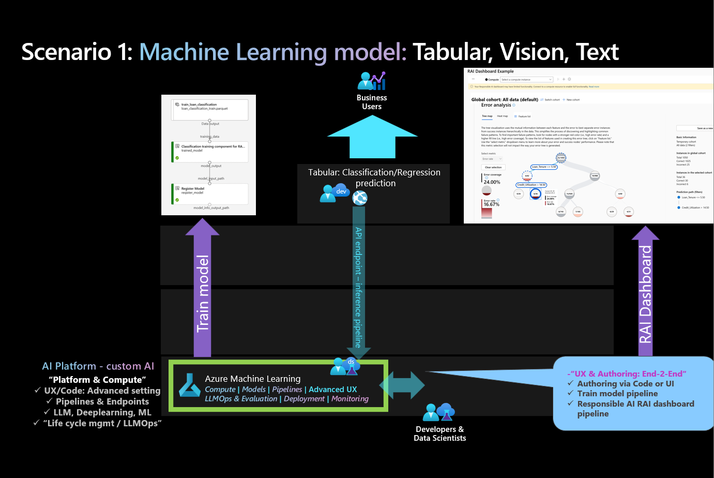
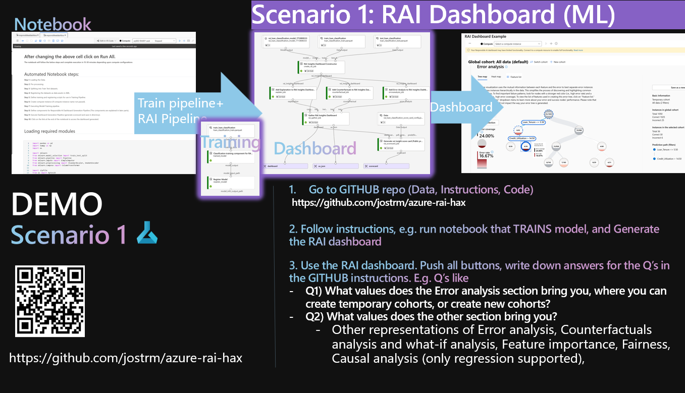
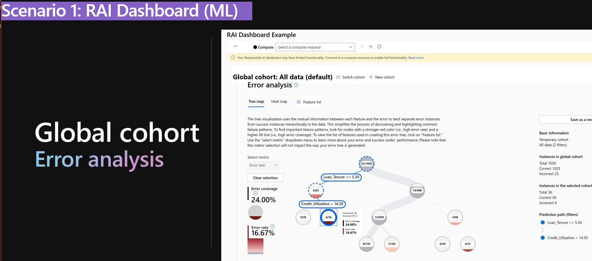

# SCENARIO 1: `Responsible AI Dashboard` and `Scorecard` i Azure machine learning for: TABULAR, TEXT, IMAGES

# ABOUT THIS Lab

This LAB will cover the **Responsible AI Dashboard** tooling in Azure Machine Learning that you can read more about here at the Microsoft documentation. 

DOCS - Responsible AI Dashboard: https://learn.microsoft.com/en-us/azure/machine-learning/concept-responsible-ai?view=azureml-api-2

In this lab there is 2 TASKS:

### About TASK 1 - Run the learning module, 
You will  get familiar with Responsible AI.

### About TASK 2 - Run the lab from GITHUB, to be able to adjust scenarios

Here you will use your own Subscription, and create your own Azure machine learning workspace.

You will be able to choose a DEMO scenario, run a notebook that generated 2 artifacts, pipelines: 

- 1st pipeline will TRAIN a model, and register the model.

- 2nd pipeline will GENERATE the RAI Dashboard

You can then use the dashboard to draw different conclusions. You can then pick another scenario, or pick your own scenario.

### Solution scenario "conceptiual view"

A conceptual view - to put the lab in context. Below is a possible scenario, where a trained model is consumed by a business user.

The RAI dashboard is included in the MLOps process, to be generated after each retraining of the model. 

### Tooling scenario

# Task 1 - Finnish the learning module

The Sandbox environment, is often "temporary unavailable" as of 2024-09 - hence bring your own Subscription.

https://learn.microsoft.com/en-us/training/modules/train-model-debug-with-responsible-ai-dashboard-azure-machine-learning/?WT.mc_id=aiml-114127-cxa

# Task 2 - Try any of these use cases & scenarios from this GITHUB repo

## ENVIRONMENT SETUP - GITHUB
You are to use the **Responsible AI** part of a GITHUB REPO. 
How to setup environment, and how to clone the repo: 
- See [Option 2 - Bring your own environment](../../environment-setup/readme.md)

## CHOOSE SUB-SCENARIO:
Choose from TABULAR, IMAGE, TEXT and any scenarios.
Recommended scenarios: 
- TABULAR: 
    - "Housing": Classification
        - https://github.com/Azure/azureml-examples/blob/main/sdk/python/responsible-ai/tabular/responsibleaidashboard-housing-classification-model-debugging/responsibleaidashboard-housing-classification-model-debugging.ipynb
    - "Healthcare - Covid" : Classification
        - https://github.com/Azure/azureml-examples/blob/main/sdk/python/responsible-ai/tabular/responsibleaidashboard-healthcare-covid-classification/responsibleaidashboard-healthcare-covid-classification.ipynb
        
- TEXT:"Covid Emergency Events": Mulitlabel Text Classification
    - https://github.com/Azure/azureml-examples/blob/main/sdk/python/responsible-ai/text/responsibleaidashboard-multilabel-text-classification-covid-events.ipynb

- IMAGE: "Fridge items": Classification, Object detection
    - NB! "Bring your own environment needed" - since GPU's are needed for this scenario.
    - https://github.com/Azure/azureml-examples/blob/main/sdk/python/responsible-ai/vision/responsibleaidashboard-image-classification-fridge.ipynb
    - https://github.com/Azure/azureml-examples/blob/main/sdk/python/responsible-ai/vision/responsibleaidashboard-object-detection-MSCOCO.ipynb

- FYI: DEMO use case the MENTOR rubs: "Loan" : Classification
    - Just FYI. Do not use the below. Since it would be boring to see the same=
    - https://github.com/Azure/azureml-examples/tree/main/sdk/python/responsible-ai/tabular/responsibleaidashboard-finance-loan-classification

## TRAIN MODEL & GENERATE RAI DASHBOARD
Create a Responsible AI Dashboard, by running notebook
 - Example: https://github.com/Azure/azureml-examples/blob/main/sdk/python/responsible-ai/tabular/responsibleaidashboard-finance-loan-classification/responsibleaidashboard-finance-loan-classification.ipynb

## EXPLORE & ANALYZE

Explore the Responsible AI Dashboard, and answer the questions
- Q1) What value does these insights give you?
- Q2) What feature impacts the prediction the most? 
- Q3) Is the dataset skewed, does it has imbalance, and if so what cohort/gender/age group is over/under represented?

Create a new cohort, based on cohort with the most errors:

- Q4) What value does these insights give you?

# EXAMPLE - ANALYSIS of sub-scenario: Loan classification (Tabular/Classification)

## Cohort with most errors

## Analysis of why - comparing if fairness exists across genders

